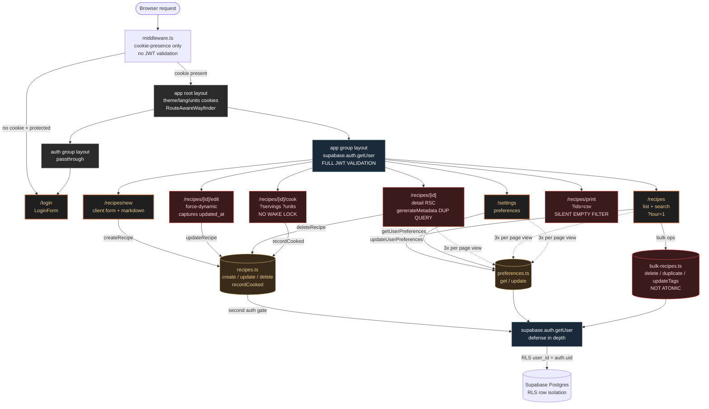

# Ideation: jc-recipes Routing Evaluation

## Grounding Context (Codebase)

### Route surface
- 9 page routes + middleware + 3 layouts
- `/` (root, redirects), `/(auth)/login`, `/(app)/recipes` (list), `/(app)/recipes/new`, `/(app)/recipes/[id]` (detail), `/(app)/recipes/[id]/edit`, `/(app)/recipes/[id]/cook`, `/(app)/recipes/print`, `/(app)/settings`
- Server actions: `createRecipe`, `updateRecipe(id, payload, expectedUpdatedAt)`, `deleteRecipe`, `recordCooked`, `bulkDuplicateRecipes`, `bulkDeleteRecipes`, `bulkUpdateTags`, `searchFdcAction`, `getUserPreferences`, `updateUserPreferences`, macros overrides

### Auth wiring (three-layer + RLS)
- `middleware.ts` — cookie-presence only (no JWT validation)
- `(app)/layout.tsx` — full `supabase.auth.getUser()` JWT validation, redirect to `/login` on miss
- Server actions — second `getUser()` call, defense in depth
- RLS — `user_id = auth.uid()` per row

### Confirmed pain points
1. Cookie-presence middleware fragile — stale cookies pass middleware, fail at layout, produce visible shimmer
2. Search params untyped at boundary — `/recipes/print?ids=` silently swallows malformed input
3. `generateMetadata()` duplicates the page body's DB query for the same recipe
4. `force-dynamic` on `/edit` (added during recent code review) disables all caching, including edge cache
5. `getUserPreferences()` called 3+ times per page view from layout, page, child components — no fragment cache

### External grounding
- CVE-2025-29927 (Mar 2025, Next 15.2.3 patched): three-layer auth = canonical pattern. CF strips `x-middleware-subrequest` at the CDN edge.
- Wake Lock API: Betty Crocker case = 3.1× session duration, 50% lower bounce, 300% higher purchase intent. `navigator.wakeLock.request('screen')` on mount, release on unmount, re-acquire on visibilitychange, force release at 60min.
- KDS analogs (Toast / Lightspeed / Oracle MICROS): station-specific views, color-coded urgency, landscape-lock, offline-first via Service Worker.
- iPad "wet hands" UX: bottom-nav ≤5 items, single floating exit, ≥44pt targets, no hover/tooltip.
- OpenNext on CF Workers: Node.js runtime (not Edge) — `@supabase/ssr` and `jose` work without compatibility shims. Workers KV powers ISR.
- Worker size limit: 10 MiB gzip on paid plan.

## Routing Visualization



<details>
<summary>Mermaid source (renders inline with bierner.markdown-mermaid extension)</summary>



</details>

## Ranked Ideas

### 1. Route-as-data registry → visualization, sitemap, breadcrumbs, agent tools
**Description:** One `src/routes.ts` exporting `{ path, params, searchParams, title, breadcrumbAncestors, agentExposed, revalidateTags, dynamic? }` per route. Mermaid + GraphML generators read the registry → emit `graphify-out/routes.mmd`. Sitemap, breadcrumbs, and agent tool catalog all derive from the same source.
**Rationale:** Directly answers the "generate a graph" deliverable AND becomes leverage for every future routing decision. Adding a route updates breadcrumbs, sitemap, agent surface, and visualization in one edit. Powers S5 by feeding schemas to `defineAction`.
**Downsides:** Up-front cost to migrate 9 routes. Drift risk if not enforced via lint rule (`scripts/check-routes-registry.mjs` could compare registry against `app/**/page.tsx` glob).
**Confidence:** 80%
**Complexity:** Medium
**Status:** Unexplored

### 2. Recipe-as-context shared layout (parallel routes + collapse `/edit` + drawer settings + prefs context)
**Description:** Restructure `(app)/recipes/[id]/*` using Next parallel routes with a shared layout that holds `recipe` + `userPreferences` as React context once. `/edit` becomes inline edit mode within detail (mode toggle). `/settings` becomes a drawer mounted at the app shell. Tab switches between detail|cook|print|notes don't refetch.
**Rationale:** Kills three documented pain points in one move — duplicate `generateMetadata` DB query (#3), `force-dynamic` blast radius (#4), 3× `getUserPreferences()` (#5). Cross-cuts F2#1 + F5#6 + F2#4 + F1#6.
**Downsides:** Largest single restructure on the list. Loses `/recipes/[id]/edit` as a stable shareable URL (rarely shared in this product, but breaks bookmarks). Optimistic-concurrency closure capture moves to client component.
**Confidence:** 70%
**Complexity:** High
**Status:** Unexplored

### 3. Cook mode polished: wake lock + `?step=N` URL state + focus mode + no-JS fallback + filter-state restore
**Description:** Five-part bundle on `/recipes/[id]/cook`:
1. `navigator.wakeLock.request('screen')` on mount, release on unmount, re-acquire on `visibilitychange`, force-release at 60min.
2. `?step=N` becomes primary URL state — resumable, shareable, survives browser crash or device hand-off.
3. `?focus=1` collapses chrome to one ingredient + one action + one timer per screen (Garmin / iA Writer pattern).
4. Server-rendered step-by-step form fallback when JS unavailable (paginated `<form method=POST>` advancing through steps).
5. `/recipes` writes `{q, tags, sort}` filter tuple to sessionStorage; cook mode back button restores it.
**Rationale:** Cook mode is the differentiating feature (graphify confirmed `Phase 2 - Cooking Companion` as 12-edge god node). Betty Crocker case shows wake lock alone = 3.1× session duration, 50% lower bounce. Aligns with KDS / iPad wet-hands UX research. Single biggest UX win on the highest-leverage surface.
**Downsides:** Wake Lock unavailable in some iOS PWA modes — must wrap in try/catch, degrade gracefully. `?step=N` URL pollution if shared without context.
**Confidence:** 90%
**Complexity:** Medium
**Status:** Unexplored

### 4. Auth that never shimmers: edge JWT-exp + `?next=` + magic-link reopens last route
**Description:** Three-part auth refresh:
1. Middleware adds `jose.decodeJwt()` on the supabase auth cookie — if `exp` past, redirect to `/login?next=<full-current-url>` immediately. Zero network cost (decode, not verify; CF strips `x-middleware-subrequest` so this is safe per CVE-2025-29927 mitigation).
2. `?next=` flows through middleware + (app) layout + login server action; preserved through magic-link callback URL.
3. Reframe `/login` as `/auth/sent` + `/auth/callback` only — expired sessions trigger an inline overlay on the current route, not a full-page navigation.
**Rationale:** Eliminates pain #1 (cookie-presence shimmer) entirely. Aligns with post-CVE-2025-29927 canonical three-layer pattern. Magic-link reframing matches "kitchen tool that knows you" identity per CLAUDE.md design intent.
**Downsides:** Magic-link overlay is more UX work than just `/login` page. Bigger UX shift than just adding the JWT exp check (could ship 4.1 alone first).
**Confidence:** 75%
**Complexity:** Medium
**Status:** Unexplored

### 5. Agent-native primitives via `defineAction` factory
**Description:** Single factory emits server action + `/api/actions/<name>` route handler + agent tool descriptor + Zod-typed search params layer.
```ts
export const updateRecipe = defineAction({
  name: 'updateRecipe',
  input: z.object({ id: z.string(), payload: RecipePayloadSchema, expectedUpdatedAt: z.string() }),
  output: z.discriminatedUnion('ok', [
    z.object({ ok: z.literal(true), data: z.object({ id: z.string() }) }),
    z.object({ ok: z.literal(false), code: z.enum(['STALE_RECORD','NOT_FOUND','FORBIDDEN','VALIDATION']), message: z.string() }),
  ]),
  agentExposed: true,
  handler: async ({ id, payload, expectedUpdatedAt }) => { /* ... */ },
});
```
**Rationale:** Once one server action conforms, every future caller (forms, `/api`, agent tools, e2e tests, MCP) keys on `code` not error string match. Existing `STALE_RECIPE_ERROR` becomes typed `'STALE_RECORD'`. Combines F3#8 + F4#5 + F4#3 + F1#3 + F4#1 into one primitive that pays compound interest.
**Downsides:** Bigger factory than current pattern. Over-engineering risk for solo-chef scale today. Pays off if/when agent integration arrives. Gates from S1 (registry feeds the schemas).
**Confidence:** 70%
**Complexity:** Medium-High
**Status:** Unexplored

### 6. `/menu/[date]` as a first-class surface
**Description:** New route family: `/menu/today`, `/menu/2026-05-03`, `/menu/saturday-dinner`. Composes multiple recipes into a service. Replaces `/recipes/print?ids=csv` anti-pattern with `/menu/[date]?view=print`. Date-keyed plans become shareable "service" artifacts. Surfaces emerge: ingredients-aggregate at `/menu/[date]?view=shopping`, prep-timeline at `/menu/[date]?view=prep`.
**Rationale:** Reframes the product from recipe-storage to service-planning — exact match for restaurant mental model and SEKAI/Sakai positioning. Bakes meal-planning into the URL surface without inventing a social layer.
**Downsides:** Adds new content domain (`menus` table or `recipe ↔ date` join). May exceed "small circle" scope. Distinct enough from current "what should I cook?" mode that it could be its own product direction — worth brainstorming before building.
**Confidence:** 65%
**Complexity:** Medium
**Status:** Unexplored

### 7. Atomic bulk mutations via Postgres RPC
**Description:** Replace loop-of-server-actions in `app/actions/bulk-recipes.ts` with `supabase.rpc('bulk_update_recipes', {...})` Postgres function in `BEGIN/COMMIT`. On any row failure the entire batch rolls back; action returns `{ok:false, failed:[id...]}` with per-id detail.
**Rationale:** Bulk-tag 40 recipes, row 23 fails RLS, rows 1-22 mutated, rows 23-40 not, UI shows green toast → silent inconsistent state. Atomic RPC + structured failure makes bulk reliable enough to trust. Concrete, low-risk, pairs with S5 result envelope.
**Downsides:** Postgres function maintenance + migration. RPC slightly less ergonomic than chained query builder. RLS check in RPC body needs careful definer/invoker choice (use invoker per recent `search_nutrition_facts` hardening pattern).
**Confidence:** 85%
**Complexity:** Low
**Status:** Unexplored

## Pair-wise Combos Worth Noting
- **S1 + S5** — registry feeds `defineAction` schemas automatically; agent tool descriptor = one entry per registry row. Build S1 first.
- **S2 + S3** — parallel-route shared layout is the natural home for cook-mode wake lock + `?step=N` state without re-fetching recipe.
- **S4 + S1** — registry knows which routes are protected; middleware reads registry to decide JWT-exp gate per path.

## Rejection Summary

| # | Idea | Reason |
|---|---|---|
| 1 | F6#3 MDX file-system DB | Not grounded — multi-user (demo@/test@) requires Postgres + RLS. Thought experiment only. |
| 2 | F6#4 Single-route SPA hash routing | Too expensive vs Next.js page model benefits; loses RSC + edge cache. |
| 3 | F6#8 Fridge 4-button two-state | Pure thought experiment, not actionable. |
| 4 | F3#6 Workspace-prefix `/[chef]/recipes` | Premature for "small circle" scope per CLAUDE.md anti-references; URL shape can be added later without rework if needed. |
| 5 | F2#7 Tag-first `/tags/[slug]/bulk-rename` | Route bloat — `bulkUpdateTags` already exists; better as inline UI on existing list filter, not a new route. |
| 6 | F5#3 cmd-K command palette | UI feature, not routing. Deserves its own ideation. |
| 7 | F5#8 Photoshop Last-Edited-Route | Duplicates F1#5 sessionStorage filter restore (weaker, server-side variant). |
| 8 | F6#7 URL-encoded session state | Subsumed by S3 (`?step=N` URL state). |
| 9 | F6#5 Edge-cached + per-user fragments | Subsumed by S2 + targeted `revalidateTag` in S2. |
| 10 | F6#1 API-first JSON-default | Subsumed by S5 `/api/*` mirror (more actionable form). |
| 11 | F2#3 Modal `/new` over list | Marginal value; recipe creation rarely needs a shareable URL. |
| 12 | F2#5 Auto-print kill `/print` as visible | `/print` URL has bookmark value (chefs print prep sheets repeatedly). |
| 13 | F3#3 Print as `?view=print` state | Low value vs current state; existing route works. |
| 14 | F2#6 Server-cookie tour, drop `?tour=1` | `?tour=1` is internal-only flag; low impact. |
| 15 | F1#9 BroadcastChannel concurrent-tab | Edge case (rare for solo-chef product); too expensive vs likely value. |
| 16 | F1#10 Deep-link settings `?return=` panes | Folded into S2 drawer-settings + `?pane=` deep-link. |
| 17 | F2#2 Auto-enter cook on landscape | Surprise mode-switch; users want explicit toggle (UX research consensus). |
| 18 | F5#5 ATC commit windows | Same outcome as S2 inline-edit; same family. |
| 19 | F5#1 KDS station `?station=` sub-views | Premature for solo chef; revisit if multi-station kitchen materializes. |
| 20 | F5#2 DAW dual-view arrangement vs session | UI feature inside detail page, not routing. |
| 21 | F5#4 Garmin step-as-page (standalone) | Subsumed by S3 (folded `?step=N` into the cook-mode bundle). |
| 22 | F5#7 iA Writer `?focus=1` (standalone) | Subsumed by S3 (folded into cook-mode bundle). |
| 23 | F6#2 No-JS resumable cook wizard (standalone) | Subsumed by S3 (folded into cook-mode bundle). |
| 24 | F6#6 Service-worker offline-first | Strong but separable; defer until Wi-Fi reliability becomes a documented user complaint. |
| 25 | F3#1 `/this-week` as home | Overlaps with `/menu/[date]` (S6); one or the other, not both. S6 wins on positioning. |
| 26 | F3#2 Slug-canonical URLs with ID redirect | Defer until shared-link surface materializes; nice-to-have not load-bearing. |
| 27 | F3#7 Magic-link reopens last route (standalone) | Folded into S4. |
| 28 | F4#7 loading.tsx + error.tsx + not-found.tsx convention | Good practice but undifferentiated; partly there already; ship as part of S2 restructure. |
| 29 | F1#3 Centralized Zod search params (standalone) | Folded into S5 `defineAction` factory. |
| 30 | F1#4 Drop force-dynamic + revalidateTag (standalone) | Folded into S2. |
| 31 | F1#5 sessionStorage filter restore (standalone) | Folded into S3. |
| 32 | F1#6 getUserPreferences React cache fragment (standalone) | Folded into S2. |
| 33 | F1#8 Per-recipe page-break controls in /print | Defer; print works currently — ship after S6 `/menu/[date]?view=print` provides cleaner home for the feature. |

## Next Steps

Recommended ordering if implementing:
1. **S1** (registry) — foundation; powers visualization deliverable + S5
2. **S7** (atomic bulk RPC) — quickest reliability win, low complexity
3. **S3** (cook mode polish) — biggest UX impact on differentiating feature
4. **S4** (auth shimmer fix) — eliminates the most-noticed friction
5. **S5** (defineAction factory) — depends on S1; pays off when MCP/agent path matures
6. **S2** (parallel routes restructure) — biggest refactor; defer until other survivors prove the architecture
7. **S6** (`/menu/[date]`) — product-direction question; brainstorm before building

To take one further: run `/ce-brainstorm` against the chosen survivor to define it precisely enough for `/ce-plan`.
