# User-Flow Audit: jc-recipes

## Visualization

Legend:
- **green outline** — entry / working forward arc
- **terracotta outline** — route surface
- **gold outline** — friction (works but degrades UX)
- **red outline** — bug (broken arc, e.g., 404)
- **dashed grey** — missing arc / missing route

## Confirmed Bug (fixed in this commit)

| Where | Problem | Fix |
|---|---|---|
| `components/recipes/CookMode.tsx:430` — Cook completion screen "Print" button | Linked to `/recipes/[id]/print` — that route does **not** exist. 404 every time a user finishes cooking and clicks Print. | Now links to `/recipes/print?ids=${recipe.id}` (canonical print URL with id). |

## Friction Points (work, but UX degrades)

| # | Surface | Problem | Recommended fix |
|---|---|---|---|
| F1 | `/recipes/[id]` detail | No "Back to recipes" link in page body. User relies on browser-back or header logo. On mobile this is the user's complaint. | Add `← Recipes` link top-left of detail page. Should preserve filter state from list. |
| F2 | `/recipes/[id]/cook` close → `/recipes/[id]` | Going back further (to filtered `/recipes`) loses filter/search/tag state. | Persist `{q, tags, sort}` to sessionStorage on list → restore on cook back. (Survivor S3 in routing-eval ideation.) |
| F3 | `/recipes/[id]/edit` Cancel | No explicit Cancel button — relies on back link. Unsaved-changes warning exists but discoverable only on submit. | Add `Cancel` button alongside `Save`. |
| F4 | `/recipes/print` direct access | No back link in body. Empty `?ids=` renders blank page with no fallback. | Add `← Recipes` link + redirect to `/recipes` when `?ids=` is empty/invalid. |
| F5 | `/settings` | No back link in body. Returning to where user came from (especially mid-cook) requires browser-back or header-logo (always lands `/recipes`). | Add `← <return path>` link; thread `?return=` query param through navigation. |
| F6 | `/login` | Always redirects to `/recipes` regardless of where user was trying to go. Session expiry mid-cook = total context loss. | `?next=<path>` preservation through middleware + login form + magic-link callback. (Survivor S4.) |
| F7 | No breadcrumb anywhere | Deep routes (`/recipes/[id]/edit`) give no path indicator. | Header-level breadcrumb derived from route registry. (Powered by Survivor S1.) |
| F8 | No bottom-nav on mobile | Single header with logo + avatar — small targets, no quick recipe→list jump. | Bottom-nav with ≤5 items per iPad wet-hands research, ≥44pt targets. |

## Missing Routes (user actions with no surface)

| Route | Why missing matters | Maps to ideation survivor |
|---|---|---|
| `/menu/[date]` — service planning | Currently `/recipes/print?ids=csv` is the only multi-recipe surface; not bookmarkable as "tomorrow's tasting menu". | S6 |
| `/shopping` — aggregated grocery list | `cooked_count` + ingredients exist; no UI to derive shopping list from selected recipes. | New (consider for next ideation cycle) |
| `/history` — recently cooked | `cooked_at` and `cooked_count` are tracked but no view exists. Phase 2 brut renders heat decay on cards but no dedicated history surface. | New |
| `/recipes/[id]/notes` — quick prep notes | Only canonical `notes` field on recipe (full edit). No scratch surface during prep that does not require entering edit mode. | New |
| `/search` — dedicated search | Search exists as filter on `/recipes` only. Not deep-linkable from outside the app (no `/search?q=...`). | Low priority |

## Available Routes (for reference)

| Route | Auth | Entry from | Exit to |
|---|---|---|---|
| `/login` | open | direct, expired session | `/recipes` (no `?next=`) |
| `/recipes` | required | login, header logo, /new submit | `/recipes/[id]`, `/recipes/new`, bulk-actions |
| `/recipes/new` | required | `/recipes` "+ NEW", markdown link | back→`/recipes`, submit→`/recipes/[id]` |
| `/recipes/[id]` | required | list card, /new submit, /edit submit, /cook close, /cook Done | Edit, Cook, Print, Delete |
| `/recipes/[id]/edit` | required | detail Edit btn | back→detail, submit→detail |
| `/recipes/[id]/cook` | required | detail Cook btn (+ servings + units) | close X→detail, Done→detail, Print→`/recipes/print?ids=` |
| `/recipes/print` | required | detail Print btn, cook completion | (no link — browser-back only) |
| `/settings` | required | header avatar menu | (no link — header logo→/recipes) |

## Suggested Implementation Priority

1. **(SHIPPED in this commit) Cook→Print 404 fix.**
2. **F1 Detail back-link** — single-line change, covers user's specific complaint.
3. **F4 Print back-link + empty-`?ids=` redirect** — same fix pattern as F1.
4. **F5 Settings back-link with `?return=`** — small but high-frequency annoyance.
5. **F6 `?next=` preservation through login** — folded into Survivor S4 (auth-never-shimmers).
6. **F2 Filter-state preserve across cook** — folded into Survivor S3 (cook-mode polished).
7. **F8 Bottom-nav on mobile** — design-led; not pure routing.
8. **F7 Breadcrumb** — depends on Survivor S1 (route-as-data registry).
9. **Missing routes** — `/menu/[date]` (S6), then `/history` and `/shopping` as Phase 3 candidates.

## Quick-win bundle (≤2 hrs)

F1 + F3 + F4 + F5 are all single-line `Link` additions with `?return=<path>` thread-through. Could ship as one commit, eliminating most of the user-perceptible "I can't get back" friction.
