# Test Suite Optimization & QA Gate — Plan

## Context

This is a personal recipe app. The test suite today is:
- **1 Jest file** (`lib/utils/__tests__/parse-recipe-markdown.test.ts`) — 44 one-assertion tests, heavy redundancy (each row of a truth table is its own `test()`).
- **5 Playwright e2e files** (`tests/e2e/*.spec.ts`) — ~40 tests × 3 browser projects (Desktop Chrome, Mobile Safari, Mobile Chrome) × `workers: 1, fullyParallel: false` = ~120 serialized runs.
- **Dead infrastructure**: `tests/e2e/global.setup.ts` captures `storageState` to `AUTH_FILE` but no project references it; every test signs in through the UI.
- **Hidden coverage gaps**: `lib/utils/export-recipes.ts` and the scaler/unit-conversion logic in `components/recipes/RecipeDetailClient.tsx` are only exercised indirectly via slow e2e tests — no unit coverage despite being pure functions.

Goal (non-negotiable): **less execution time, less redundancy, maximum coverage**. Every removal must be provably covered elsewhere.

## Shape of the change

```mermaid
flowchart LR
  subgraph Before["BEFORE"]
    direction TB
    B1["Jest: 44 one-assert tests<br/>(one parse per assertion)"]
    B2["Playwright: ~40 × 3 projects<br/>workers=1, fullyParallel=false<br/>UI sign-in per test<br/>UI seed via form fill"]
    B3["No coverage:<br/>export-recipes.ts<br/>scaler/unit conversion"]
  end

  subgraph After["AFTER"]
    direction TB
    A1["Jest: ~12 table-driven tests<br/>(test.each, one parse per block)<br/>+ scaling.test.ts + export-recipes.test.ts"]
    A2["Playwright: ~28 tests<br/>tiered: @smoke / @regression<br/>parallel workers<br/>storageState reuse<br/>API seed via Supabase"]
    A3["Pure logic extracted to<br/>lib/utils/scaling.ts<br/>covered by unit tests"]
  end

  subgraph Gate["QA GATE (Part 2)"]
    direction TB
    G1["pre-commit hook<br/>detects new *.test.* / *.spec.*"]
    G2["scripts/test-gate.mjs<br/>heuristics + Claude analysis"]
    G3["CI job: .github/workflows/test-gate.yml"]
    G4["Block / warn / override<br/>CONTRIBUTING_TESTS.md"]
  end

  Before -->|Part 1: audit & refactor| After
  After -->|Part 2: prevent regressions| Gate
```



## Test inventory (baseline)

| File | Type | Tests | Issues |
|---|---|---:|---|
| `lib/utils/__tests__/parse-recipe-markdown.test.ts` | unit | 44 | `parseTimeToMinutes` (13), `parseIngredient` (11), `parseStepTimer` (6), full recipe (16) — most are truth-table rows authored as separate `test()` blocks. Full-recipe block re-runs parser 16× and each check is its own test. |
| `tests/e2e/auth.spec.ts` | e2e | 7 | 5 of 7 re-sign in through UI. "login page renders" is a shallow render smoke test overlapping with every other auth test. |
| `tests/e2e/recipes-crud.spec.ts` | e2e | 8 | `empty state` only asserts heading visible (low value). `create` + `detail` overlap. Every test signs in through UI. "mobile touch target 44px" duplicates same assertion in auth.spec. |
| `tests/e2e/markdown-import.spec.ts` | e2e | 3 | Desktop import flow duplicates parser assertions (already covered by Jest). |
| `tests/e2e/bulk-ops.spec.ts` | e2e | 8 | `enter/exit select mode` + `selecting a card shows bar` are sub-steps of the bulk-delete/tag/export flows. |
| `tests/e2e/phase2.spec.ts` | e2e | 14 | Scaler math tested via DOM (3 tests) — pure math, belongs in unit tests. `timer controls` has conditional assertions that silently pass when feature is absent. |
| `tests/e2e/global.setup.ts` | setup | 1 | Writes auth file nothing uses. |

Baseline run count: **44 Jest + ~120 Playwright** (`~40 × 3` projects).

## Part 1 — Audit & Reduce

### 1A. Extract pure logic so it can be unit-tested (enables e2e reduction)

Create `lib/utils/scaling.ts` by moving (not duplicating) these pure functions from `components/recipes/RecipeDetailClient.tsx:12-103`:
- `FRACTIONS`, `snapFraction`, `formatAmount`
- `METRIC_TO_IMPERIAL`, `IMPERIAL_TO_METRIC`, `convertUnit`, `processIngredients`

Leave a thin import in `RecipeDetailClient.tsx`. No behavior change.

New unit tests:
- `lib/utils/__tests__/scaling.test.ts` — table-driven coverage of `formatAmount` (fractions, decimals, >10 rounding), `convertUnit` (g↔oz, ml↔fl oz, unknown passthrough, null unit), `processIngredients` (×0.5, ×1, ×2, ×3.7 with mixed units).
- `lib/utils/__tests__/export-recipes.test.ts` — round-trip: `parseRecipeMarkdown(recipeToMarkdown(r))` preserves core fields for 3 fixture recipes. Adds unit coverage for `export-recipes.ts` which currently has none and is only hit via `bulk-ops.spec.ts › bulk export MD`.

### 1B. Collapse Jest redundancy (parse-recipe-markdown.test.ts)

Rewrite the file in place:
- Replace 13 `parseTimeToMinutes` tests with one `test.each` table (same rows, same coverage, one `test()`).
- Same for 11 `parseIngredient` tests and 6 `parseStepTimer` tests.
- Full-recipe block: parse `FULL_MD` once in a `beforeAll`, collapse 16 asserts into 3 `test()` blocks grouped by concern (metadata, ingredients, steps+notes+tags). Preserves every assertion — just stops creating 16 Jest test entries for one parse.
- Keep all edge-case tests as-is (they each exercise distinct parser paths).

Expected result: **44 → ~12 tests**, identical assertion coverage, ~10× fewer parser invocations.

### 1C. Playwright — infrastructure changes

`playwright.config.ts`:
- `fullyParallel: true`
- `workers: process.env.CI ? 2 : '50%'`
- Add `storageState: 'tests/e2e/.auth/user.json'` on all projects *except* `auth` (which must drive the UI sign-in).
- Tag-based project sharding:
  - Project `Desktop Chrome` runs everything.
  - `Mobile Safari` and `Mobile Chrome` run only tests tagged `@mobile` or `@cross-browser` via `grep: /@mobile|@cross-browser/`.
- Keep retries/timeout as-is.

`tests/e2e/global.setup.ts`: already writes the auth file — wire it up as a setup project (`dependencies: ['setup']`) so storageState is always fresh.

`tests/e2e/helpers.ts` (new): extract shared helpers.
- `signIn(page)` — only used by `auth.spec.ts` now.
- `seedRecipe(request, { name, ... })` — creates a recipe via Supabase JS client using `TEST_USER_PASSWORD` creds instead of clicking the form. This is the biggest time win: form-based seed is ~5-15s per recipe; API seed is ~100-300ms. Used by every non-UI-creation test.
- `uniqueName(prefix)` — worker-scoped prefix (`${prefix}-${process.env.TEST_WORKER_INDEX}-${Date.now()}`) so parallel workers can't collide.

### 1D. Playwright — tiered runs and test tagging

Tag convention (Playwright `test('name @tag', ...)` or `test.describe` suffix):
- `@smoke` — must pass on every push; one representative happy path per feature area. Target: ~8 tests, <60s total.
- `@regression` — full desktop behavior (default on PR). Target: ~22 tests, ~3-4 min parallel.
- `@mobile` / `@cross-browser` — only runs that genuinely differ per-viewport/browser. Target: ~6 tests × 2 mobile projects.

Add `package.json` scripts:
- `test:e2e:smoke` → `playwright test --grep @smoke --project='Desktop Chrome'`
- `test:e2e` stays as full run.

### 1E. Playwright — concrete reductions

| File | Action | Justification |
|---|---|---|
| `auth.spec.ts` | Keep 4 tests: login renders + error (merge), login success + logout round-trip (merge), unauth→/login, mobile layout `@mobile`. Remove `authenticated user visiting /login is redirected` — covered by login-success assertion chain. | Every auth path still exercised; merged tests share one sign-in. 7→4. |
| `recipes-crud.spec.ts` | Remove `empty state` (heading-visible only — already asserted in every other test). Remove `mobile touch target` (duplicate of auth.spec mobile assertion — keep only one). Merge `create happy path` + `recipe detail shows all persisted fields` into one test (same flow). Use `seedRecipe()` for edit/delete setup → ~10s saved each. | 8→5. Every CRUD path still exercised; seed swap trades UI-form redundancy (covered by the one create test) for speed. |
| `markdown-import.spec.ts` | Remove parser assertion duplication in desktop test — keep only DOM-wiring asserts (input → preview → form populated → save). Merge the `disabled when empty` test into the main flow (assert disabled at start, then enabled after fill). Keep mobile stacking `@mobile`. | 3→2. Parser correctness covered exhaustively by Jest in 1B. |
| `bulk-ops.spec.ts` | Merge `enter/exit select mode` + `selecting a card` + `select-all` into one "select-mode workflow" test (linear assertions, same setup cost once). Replace `createQuickRecipe` form-fills with `seedRecipe()`. Remove `bulk delete cancel` (cancel-dialog pattern already covered by `recipes-crud.spec.ts › cancel on delete dialog`). | 8→5. |
| `phase2.spec.ts` | Remove 3 scaler tests (math now unit-tested in `scaling.test.ts`); replace with 1 integration test that asserts scaler button click updates `ingredient-amount-0` text (DOM wiring only). Remove `timer controls` (silently passes when feature absent — an over-specified test with no guaranteed assertion). Keep search (3 tests → consolidate "empty state" + "clear restores" into one), tag filter (2→1 by chaining), cooking mode nav, wake lock, progress bar, mobile ingredient sheet `@mobile`. | 14→8. |

Result: **~40 → ~24 tests** on desktop, **~6 mobile-tagged × 2 mobile projects = 12** instead of 40 × 2 = 80. Total Playwright runs: **~36 vs. 120**.

### 1F. Estimated impact

- Jest: 44 → ~14 tests (includes 2 new files). Runtime drop from ~2s to sub-second; full-recipe parser called 1× instead of 16×.
- Playwright: 120 → ~36 runs. Combined with `workers=2` parallelism and storageState reuse (saves ~3-5s/test × 30+ tests), projected wall-clock: **from ~15-20 min → ~3-5 min** on CI.
- Coverage: **increases** — `scaling.ts` and `export-recipes.ts` go from 0% unit coverage to ~full coverage; e2e behavior coverage preserved by the tests we keep.

## Part 2 — QA Optimization Gate

### 2A. Detection: pre-commit hook

Create `.githooks/pre-commit`:
```sh
#!/usr/bin/env bash
set -e
CHANGED=$(git diff --cached --name-only --diff-filter=AM | grep -E '(\.test\.|\.spec\.)(ts|tsx|js)$' || true)
if [ -z "$CHANGED" ]; then exit 0; fi
exec node scripts/test-gate.mjs $CHANGED
```

Install via `package.json` `"prepare": "git config core.hooksPath .githooks"` (no Husky dep — project already avoids extra deps).

### 2B. Analyzer: `scripts/test-gate.mjs`

Three layers, in order (fast deterministic first, Claude last):

1. **Deterministic heuristics** (always run, pure Node, no network):
   - **Duplicate title**: for each added `test('X', ...)` or `test('X @tag', ...)`, compute normalized-title Jaccard similarity against all existing test titles in repo. `>0.85` → fail with pointer to the likely duplicate file:line.
   - **Single-assertion parameterizable**: if the new test body has exactly one `expect()` and the surrounding `describe` already has ≥3 sibling single-`expect` tests, fail with `"Use test.each — see <file>:<line> for pattern"`.
   - **Form-fill seeding in e2e**: if a new e2e test calls `page.goto('/recipes/new')` + `#name` fill, and `seedRecipe` exists in helpers, fail with `"Use seedRecipe() — form-based setup is ~30× slower"`.
   - **Missing tag on e2e test**: require exactly one of `@smoke | @regression | @mobile | @cross-browser` in the test title → fail otherwise.
   - **Budget**: compute delta vs. `.test-gate/baseline.json` (tracked file containing last-known test counts and p95 durations per file). New test must either replace a removed test OR come in under a per-file cap (configurable, default: +1 test per PR, ≤30s est. runtime).

2. **Claude analysis** (opt-in, runs only if `claude` CLI is on PATH — gate degrades gracefully without it):
   - Shell out to `claude -p --output-format json` with a prompt containing: the diff hunk(s), existing test titles in the same file, and a JSON schema requesting `{duplicateOf: string|null, canParameterizeWith: string|null, coverageValue: "high"|"med"|"low", rationale: string}`.
   - `duplicateOf` or `coverageValue: "low"` → fail with rationale; developer sees the reason inline.
   - Timeout 30s; on failure or missing CLI, log a notice and continue (heuristics alone must gate).

3. **Report**: always write `.test-gate/last-report.md` (human-readable) with:
   - Tests added / consolidated / removed this commit
   - Estimated runtime delta (sum of p95s for added − removed)
   - Suite health score = `weighted(coverage%, duration, redundancy_density)` with a visible breakdown
   - Coverage delta if `coverage/coverage-summary.json` exists

### 2C. Override

Block is hard by default. Explicit override: commit message contains `[test-gate-override: <reason>]` → gate emits a warning and records the override in `.test-gate/overrides.log`. No silent bypass. `--no-verify` is out of scope (project-level policy in `CONTRIBUTING_TESTS.md`).

### 2D. CI integration

`.github/workflows/test-gate.yml`:
- Trigger: `pull_request`.
- Steps: checkout with `fetch-depth: 0`, `npm ci`, run `node scripts/test-gate.mjs $(git diff --name-only origin/main...HEAD | grep -E '\.(test|spec)\.')`, fail job on non-zero.
- Uploads `.test-gate/last-report.md` as a PR comment via `actions/github-script` (or a simple `gh pr comment`).
- Claude step is optional; uses `ANTHROPIC_API_KEY` secret if present, else heuristics only.

### 2E. Team documentation

`CONTRIBUTING_TESTS.md` at repo root:
- **Core principle**: every new test must earn its place by adding net coverage value, not net execution cost.
- Rules: one tag per e2e test; unit-first for pure functions; use `seedRecipe` for e2e data setup; no single-assertion tests outside `test.each` tables; single-`expect` rule; reuse `storageState`.
- Gate criteria table (pass/fail/warn) with example messages.
- Override procedure and when it's legitimate.
- Pointer to `.test-gate/last-report.md` format.

## Files touched (summary)

**New:**
- `lib/utils/scaling.ts`
- `lib/utils/__tests__/scaling.test.ts`
- `lib/utils/__tests__/export-recipes.test.ts`
- `tests/e2e/helpers.ts`
- `.githooks/pre-commit`
- `scripts/test-gate.mjs`
- `.github/workflows/test-gate.yml`
- `.test-gate/baseline.json`
- `CONTRIBUTING_TESTS.md`
- `TEST_REDUCTION_LOG.md`

**Modified:**
- `lib/utils/__tests__/parse-recipe-markdown.test.ts` (collapse to `test.each`)
- `components/recipes/RecipeDetailClient.tsx` (import from `scaling.ts`)
- `playwright.config.ts` (parallelism, storageState, project grep tags)
- `tests/e2e/global.setup.ts` (wired as dependency project)
- `tests/e2e/auth.spec.ts`, `recipes-crud.spec.ts`, `markdown-import.spec.ts`, `bulk-ops.spec.ts`, `phase2.spec.ts` (reductions per 1E, use helpers)
- `package.json` (`prepare` hook path, `test:e2e:smoke`, `test:gate` scripts)
- `CLAUDE.md` (update the `Playwright e2e 96/96 ✓` line to reflect new topology)

**Deleted:** none at file level — every removed test is folded into a kept test in the same file.

## Verification

1. `npm test` — Jest passes; assertion count check: the truth-table rewrite must keep every input/expected pair from the original file (sanity-check by diffing the `test.each` tables against the old `test()` titles).
2. `npx playwright test --project='Desktop Chrome'` — all desktop tests pass in parallel.
3. `npx playwright test --project='Mobile Safari' --grep @mobile` — mobile-tagged tests pass.
4. `npx playwright test --grep @smoke` — completes in <90s on a clean CI box.
5. Gate smoke tests: stage a synthetic duplicate test (`git add` a file with a known-duplicate title), run `node scripts/test-gate.mjs <file>`, assert exit 1 and report names the duplicate. Repeat for: single-assert test, missing tag, form-fill e2e setup.
6. Confirm hook installation: fresh clone → `npm install` → `git config --get core.hooksPath` returns `.githooks`.
7. Re-run full e2e; compare `time` output to baseline in this plan — target ≥60% wall-clock reduction.

## Phasing (for TEST_REDUCTION_LOG.md)

**Phase 1 (now, this PR):**
- All of Part 1A–1F (extract, refactor, collapse, tag, parallelize).
- All of Part 2A–2E (gate + docs), with Claude layer gated on CLI presence.

**Phase 2 (follow-up, explicitly deferred and noted in TEST_REDUCTION_LOG.md):**
- Per-worker test users to eliminate the remaining shared-state risk in parallel writes (needs Supabase admin script).
- Component-level tests with React Testing Library for `RecipeForm` / `CookMode` to replace 2-3 more e2e tests.
- Mutation testing run (Stryker or `@stryker-mutator/jest-runner`) to validate that the reduced Jest suite retains mutation-kill ratio ≥ baseline.
- Playwright test-duration cache (`.test-gate/baseline.json` auto-updated from `test-results/` after green runs) so the budget check is self-calibrating.
